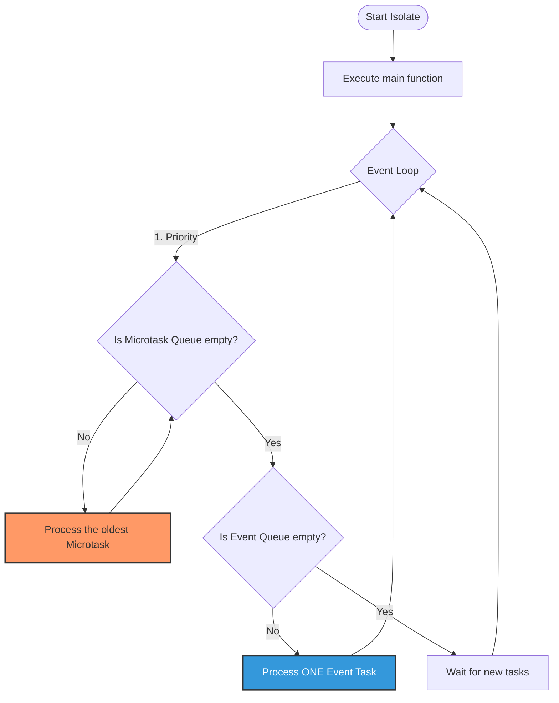

# 1. Dart의 심장: Event Loop (이벤트 루프)

Dart는 기본적으로 **싱글 스레드** 언어입니다. 스레드가 하나뿐인데 어떻게 네트워크 통신을 하면서 동시에 UI 애니메이션을 부드럽게 그릴 수 있을까요? 바로 **Event Loop** 덕분입니다. 안드로이드의 Main Looper나 Node.js의 이벤트 루프와 비슷한 개념입니다. Dart의 이벤트 루프는 두 개의 큐(Queue)를 관리합니다.

1. **Microtask Queue**: 가장 우선순위가 높습니다. 주로 내부적인 상태 업데이트나 아주 짧은 비동기 작업이 들어갑니다.
2. **Event Queue**: I/O 작업(네트워크, 파일 읽기), 타이머, 마우스 터치 이벤트, 화면 그리기(Paint) 등이 들어갑니다.

> **💡 핵심 원리**: 이벤트 루프는 Microtask Queue가 완전히 비워질 때까지 Event Queue를 쳐다보지 않습니다. 따라서 무거운 연산을 메인 스레드에서 돌리면 Event Queue에 있는 '화면 그리기(UI Update)' 작업이 실행되지 못해 앱이 멈추는 현상(Jank)이 발생합니다.
>

## 1-1. 기본 개념

Dart 코드는 기본적으로 Isolate(아이솔레이트)라는 단위 내에서 실행됩니다. 각 Isolate는 하나의 스레드와 고유한 메모리 공간을 가지며, 시작과 동시에 **이벤트 루프**를 실행하여 큐(Queue)에 쌓인 작업들을 처리합니다.

## 1-2. 이벤트 루프의 내부 구조 (Mermaid 그래프)

이벤트 루프는 두 개의 큐를 관리하며, Microtask Queue가 완전히 빌 때까지는 Event Queue를 절대 쳐다보지 않는다는 철저한 우선순위 원칙을 따릅니다.



## 1-3. 두 개의 큐(Queue) 상세 분석

### 1) Microtask Queue (우선순위: 높음)

"지금 하던 일 바로 다음에 처리해야 할 긴급한 내부 작업"들을 담습니다.

- **담당 기능**: 비동기 작업 간의 내부 상태 변경, 리소스 정리, 아주 짧은 로직 실행 등.
- **특징**:
    - Event Queue보다 먼저 처리됩니다.
    - Microtask Queue가 비워질 때까지 Event Queue의 작업(화면 그리기 포함)은 중단(Blocking)됩니다.
- **생성 방법**: Future.microtask(...) 또는 scheduleMicrotask(...).

### 2) Event Queue (우선순위: 낮음)

"외부에서 들어온 모든 이벤트"들을 담습니다.

- **담당 기능**:
    - I/O 작업 (네트워크 응답, 파일 읽기/쓰기).
    - 사용자 입력 (터치, 제스처).
    - 타이머 (Timer, Future.delayed).
    - **화면 그리기 (Drawing/Painting signal)**: Flutter의 60fps를 유지하는 렌더링 신호도 이 큐에 담깁니다.
- **특징**:
    - Microtask Queue가 텅 비었을 때만 하나씩 꺼내서 실행합니다.
- **생성 방법**: Future, Stream, 사용자 상호작용 등 일반적인 모든 비동기 작업.

## 1-4. 왜 큐가 두 개일까?

이 질문에 대한 답은 안정적인 내부 로직 처리와 **부드러운 사용자 경험(UX)** 사이의 균형에 있습니다.

### 이유 1: 시스템 안정성과 논리적 완결성

특정 비동기 작업(Event)이 끝난 직후, 해당 결과에 따라 **다른 외부 이벤트를 받기 전에 반드시 처리해야 할 내부 정리 작업**이 있을 수 있습니다.

만약 큐가 하나라면, 긴급한 내부 정리 작업이 나중에 들어온 무거운 네트워크 응답이나 사용자 터치 이벤트 뒤로 밀려 데이터 무결성이 깨질 수 있습니다. Microtask Queue는 이 "중간 틈새"를 메워주는 역할을 합니다.

### 이유 2: UI 응답성 제어

Microtask는 주로 시스템 내부용으로 설계되었습니다. 만약 개발자가 모든 비동기 작업을 고우선순위로 처리한다면, 화면을 그리는 이벤트(Drawing)가 계속 밀려 앱이 얼어버리는(Jank) 현상이 발생합니다.

따라서 중요하지만 짧은 작업(Microtask)과 일반적인 비동기 작업(Event)을 분리하여, 이벤트 루프가 효율적으로 CPU 자원을 분배할 수 있게 한 것입니다.

## 1-5. 주의사항: "Microtask의 함정"

가장 흔한 성능 저하 사례 중 하나는 **Microtask Queue를 남용**하는 것입니다.

```dart
void heavyWork() {
  // 만약 여기서 무한히 Microtask를 생성한다면?
  scheduleMicrotask(() {
    heavyWork(); 
  });
}
```

위와 같은 코드가 실행되면 **Event Queue는 영원히 실행되지 않습니다.**

1. 사용자 터치가 무시됩니다.
2. Future.delayed가 실행되지 않습니다.
3. 가장 치명적으로, **프레임 렌더링 작업이 중단되어 화면이 멈춥니다.**

---

# 2. Future (단일 비동기 응답)

Future는 "지금 당장은 값이 없지만, 미래에 값을 줄게"라는 약속입니다.

- **Kotlin 비교**: Coroutine의 suspend 함수가 반환하는 단일 값과 완벽히 동일합니다. (JavaScript의 Promise와도 같습니다.)
- 비동기 작업(네트워크 요청, 파일 I/O 등)을 시작하면 즉시 Future 객체가 반환됩니다.
- 이 객체는 지금 당장 데이터는 없지만, 작업이 완료되면 결과값 혹은 에러를 전달하겠다는 상태 정보를 가지고 있습니다.

### Future의 3가지 상태

1. **Uncompleted (대기)**: 비동기 작업이 아직 진행 중인 상태.
2. **Completed with Value (성공)**: 작업이 성공적으로 끝나서 결과값을 반환한 상태.
3. **Completed with Error (실패)**: 작업 도중 문제가 생겨 에러가 발생한 상태.

## 1-1. 사용 방법: 구문론적 차이

### then()과 catchError() (콜백 방식)

초기 Dart에서 사용하던 방식으로, 비동기 작업의 결과를 콜백 함수로 처리합니다.

```dart
Future<String> fetchData() {
  return Future.delayed(Duration(seconds: 2), () => "Data Loaded");
}

void main() {
  print("Start");
  fetchData()
    .then((value) => print(value))
    .catchError((e) => print(e))
    .whenComplete(() => print("Done"));
  print("End");
}
```

### async와 await (선언형 방식)

비동기 코드를 마치 동기 코드(순차적)처럼 가독성 있게 작성할 수 있도록 돕는 키워드입니다.

```dart
// Kotlin의 suspend fun fetchUserData(): String 과 동일
Future<String> fetchUserData() async {
  // 2초 동안 대기 (이때 스레드를 멈추는 Blocking이 아니라, 
  // 이벤트 루프에 "2초 뒤에 깨워줘"라고 예약하고 제어권을 넘김 - Suspending)
  await Future.delayed(const Duration(seconds: 2));
  return "Kumgold";
}

void main() async {
  print("1. 데이터 요청 시작");
  
  // await를 만나면 fetchUserData가 끝날 때까지 아래 코드는 대기함
  String user = await fetchUserData(); 
  
  print("2. 데이터 수신 완료: $user");
}
```

## 1-2. Future와 Event Loop의 관계 (동작 원리)

가장 중요한 부분입니다. Future는 어떻게 실행될까요?

1. Future가 생성되면, 해당 비동기 작업은 **Event Queue**에 등록됩니다.
2. 현재 실행 중인 동기 코드(main 함수 등)가 모두 완료될 때까지 기다립니다.
3. 이벤트 루프가 돌면서 **Event Queue**에서 Future 작업을 꺼내 실행합니다.
4. 작업이 완료되어 값이 준비되면, 그 결과를 기다리던(await) 코드가 다시 실행 스케줄링에 오르게 됩니다.

### ⚠️ 주의: Future는 멀티 스레드가 아니다!

많은 개발자가 오해하는 부분입니다. await를 한다고 해서 새로운 스레드가 생기는 것이 아닙니다.

- 단지 **"기다리는 시간(Waiting)"** 동안 CPU가 다른 일(애니메이션 렌더링 등)을 할 수 있도록 **순서를 양보**하는 것뿐입니다.
- 만약 Future 내부에서 await 없이 10초 동안 숫자를 세는 연산을 한다면, UI는 그대로 멈춥니다. (이럴 땐 Isolate를 써야 합니다.)

## 1-3. 유용한 Future API들

### 1) Future.wait() (병렬 실행)

여러 개의 비동기 작업을 동시에 시작하고, 모든 작업이 끝날 때까지 기다립니다. (Kotlin의 awaitAll()과 유사)

```dart
void main() async {
  // 세 가지 요청을 동시에 시작
  final results = await Future.wait([
    fetchUserInfo(),
    fetchUserPosts(),
    fetchUserFriends(),
  ]);
  
  print(results[0]); // UserInfo
  print(results[1]); // UserPosts
}
```

### 2) Future.microtask() (우선 처리)

일반 Future보다 높은 우선순위를 갖는 **Microtask Queue**에 작업을 넣습니다.

```dart
Future(() => print("Event Queue Task")); // 일반
Future.microtask(() => print("Microtask Queue Task")); // 우선순위 높음
print("Sync Task");

// 결과: Sync Task -> Microtask -> Event Queue
```

### 3) Future.sync()

정의된 로직을 즉시(동기적으로) 실행합니다. 만약 결과가 Future라면 비동기로 처리되지만, 내부의 첫 문장은 호출 즉시 실행됩니다.

## 1-4. Kotlin Coroutine vs Dart Future 비교

| **특징** | **Kotlin Coroutines** | **Dart Future** |
| --- | --- | --- |
| **반환 타입** | suspend 함수 (결과값) | Future<T> 객체 |
| **중단 지점** | suspend 키워드 | await 키워드 |
| **실행 환경** | 멀티 스레드 (Dispatchers) | 싱글 스레드 (Event Loop) |
| **동시성** | 구조적 동시성 (Job, Scope) | 개별 객체 기반 |

## 1-5. 요약

### 📌 핵심 정의

- `Future<T>`: 비동기 작업의 결과를 담는 객체.
- 싱글 스레드 기반의 Dart에서 I/O Non-blocking 처리를 가능케 함.

### ⚙️ 동작 원리

- `Future`는 기본적으로 **Event Queue**에 담김.
- `await`를 만나면 현재 실행 흐름을 일시 중단하고, 이벤트 루프가 다른 작업(UI 렌더링 등)을 처리할 수 있도록 양보함.
- 연산이 무거운 작업(CPU-bound)은 `Future`로 만들어도 메인 스레드를 점유하므로 주의가 필요함.

### 🛠️ 주요 API

- `await`: 비동기 완료까지 대기.
- `Future.wait([])`: 여러 Future를 병렬로 실행 후 일괄 수령.
- `Future.microtask()`: 다음 이벤트 이전에 처리해야 할 고우선순위 작업.

### 🚀 실무 팁

- API 호출이나 DB 접근처럼 "기다림"이 필요한 작업은 무조건 `Future`를 사용하세요.
- 하지만 데이터가 수만 개라면 `Future`만으로는 부족하며, 데이터의 흐름을 다루는 `Stream`으로 확장해야 합니다.

---

# 3. Stream (연속적인 비동기 응답)

한 번 응답하고 끝나는 Future와 달리, Stream은 **시간의 흐름에 따라 여러 개의 데이터를 지속적으로 방출**합니다.

- **Kotlin 비교**: Kotlin Flow 또는 RxJava의 Observable과 완벽히 대응됩니다.
- **Flutter 활용**: BLoC 패턴의 상태 변화, Firebase 실시간 데이터베이스, 위치 정보 업데이트 등에 필수적입니다.

## 3-1. 개념: Future vs Stream

- **Future**: 요청하면 미래의 어느 시점에 **딱 하나의 데이터**를 주고 종료됩니다. (햄버거 주문)
- **Stream**: 한번 연결해두면 데이터가 생길 때마다 **여러 번** 전달합니다. (배달 앱의 실시간 위치 확인)

## 3-2. 스트림의 두 가지 종류

Dart의 스트림은 '구독 방식'에 따라 두 가지로 나뉩니다. 이 구분을 못 하면 앱에서 예상치 못한 크래시를 만날 수 있습니다.

### 1) 단일 구독 스트림 (Single-subscription Stream)

- **특징**: 단 **한 명의 리스너**만 가질 수 있습니다.
- **동작**: 리스너가 구독을 시작하기 전까지는 이벤트를 발생시키지 않고 기다리며(Cold), 한 번 구독이 취소되면 다시 구독할 수 없습니다.
- **용도**: 파일 읽기, 대용량 HTTP 다운로드 등 일회성 데이터 흐름.

### 2) 브로드캐스트 스트림 (Broadcast Stream)

- **특징**: **여러 명의 리스너**가 동시에 구독할 수 있습니다.
- **동작**: 리스너가 있든 없든 이벤트가 발생하며(Hot), 늦게 구독한 리스너는 구독 시점 이전의 데이터는 받지 못합니다.
- **용도**: 알람 설정, 마우스 터치 이벤트, BLoC의 상태 변경 알림.

```jsx
// 일반 스트림을 브로드캐스트로 변환
final broadcastStream = singleStream.asBroadcastStream();
```

## 3-3. 스트림을 만드는 방법

### 방식 A: 비동기 제너레이터 (async* & yield)

가장 권장되는 선언형 방식입니다.

```dart
Stream<int> countStream(int max) async* {
  for (int i = 1; i <= max; i++) {
    await Future.delayed(const Duration(seconds: 1));
    yield i; // 값을 스트림으로 내보냄 (Emit)
  }
}
```

### 방식 B: StreamController

명령형 방식으로, 외부에서 데이터를 주입해야 할 때(예: BLoC 패턴) 사용합니다.

```dart
final controller = StreamController<String>();

// 데이터 주입 (Sink)
controller.sink.add("Hello");
controller.sink.add("Dart");

// 데이터 소비 (Stream)
controller.stream.listen((data) => print(data));

// 사용 완료 후 반드시 닫아야 함 (메모리 누수 방지)
controller.close();
```

## 1-4. 스트림 소비하기

### 1) listen()

가장 기본적인 방식입니다. onData, onError, onDone 콜백을 지정할 수 있습니다.

### 2) await for

함수 내에서 async 키워드와 함께 사용하여 스트림 데이터를 반복문처럼 처리합니다.

```dart
void main() async {
  var stream = countStream(5);
  
  await for (final value in stream) {
    print(value); // 1, 2, 3, 4, 5
  }
  print("Stream closed!");
}
```

## 1-5. 스트림 변환 (Operators)

Dart는 스트림 데이터를 가공할 수 있는 다양한 연산자를 기본 제공합니다. (Rx와 유사)

```dart
stream
  .where((val) => val % 2 == 0)      // 필터링 (Filter)
  .map((val) => "Number: $val")      // 변환 (Map)
  .take(3)                          // 처음 3개만 받기
  .listen(print);
```

## 1-6. Kotlin Flow vs Dart Stream 비교

| **특징** | **Kotlin Flow** | **Dart Stream** |
| --- | --- | --- |
| **기본 성격** | Cold Stream (기본) | Single-sub (Cold) / Broadcast (Hot) |
| **생성 키워드** | flow { emit() } | async* { yield } |
| **종료** | 스코프 종료 시 자동 취소 | StreamSubscription.cancel() 필요 |
| **강점** | Coroutine Context 결합 | 언어 자체의 기본 비동기 표준 |

## 1-7. 요약

### 📌 핵심 정의

- `Stream<T>`: 지속적으로 발생하는 비동기 데이터의 통로.
- **Single-subscription**: 일대일 통신, 재구독 불가, Cold 방식.
- **Broadcast**: 일대다 통신, 여러 리스너 허용, Hot 방식.

### 🛠️ 생성 및 제어

- `async*`와 `yield`: 스트림을 생성하는 표준 방식.
- `StreamController`: 수동으로 데이터를 넣고(`Sink`) 빼는(`Stream`) 제어 장치.
- `StreamSubscription`: `listen()`의 결과물로, 반드시 `cancel()`을 호출하여 **메모리 누수**를 방지해야 함.

### 🚀 실무 적용 예시 (BLoC 패턴의 기초)

```dart
class CounterBloc {
  int _count = 0;
  final _controller = StreamController<int>();

  Stream<int> get counterStream => _controller.stream;

  void increment() {
    _count++;
    _controller.sink.add(_count);
  }

  void dispose() => _controller.close();
}
```

---

# 4. 진짜 멀티 스레딩이 필요하다면? (Isolate)

앞서 Dart는 싱글 스레드라고 했습니다. 만약 100MB짜리 거대한 JSON 파일을 파싱해야 한다면 어떻게 될까요?

이벤트 루프가 JSON을 파싱하느라 짧게는 몇 백 밀리초 동안 화면을 그리지 못해 UI가 얼어버립니다(프레임 드랍).

이럴 때 사용하는 것이 Isolate(아이솔레이트)입니다.

- **Kotlin 비교**: Dispatchers.Default (백그라운드 스레드 풀)로 작업을 넘기는 것과 같습니다.
- **특징**: Isolate는 이름(격리) 그대로 메인 스레드와 **메모리를 공유하지 않는 완전히 독립된 작업자**입니다. (안전하지만 통신 비용이 발생함)

```dart
import 'dart:isolate';
import 'dart:convert';

// 무거운 작업 (백그라운드에서 실행될 함수)
Map<String, dynamic> parseHugeJson(String jsonString) {
  return jsonDecode(jsonString); // CPU를 많이 쓰는 동기 작업
}

Future<void> loadData(String hugeJson) async {
  // Isolate.run()을 통해 무거운 파싱 작업을 별도의 Isolate(스레드)로 던짐
  // 메인 스레드는 멈추지 않고 애니메이션을 계속 그릴 수 있음!
  final parsedData = await Isolate.run(() => parseHugeJson(hugeJson));
  
  print("파싱 완료: ${parsedData.length}개의 아이템");
}
```

## 1-1. Isolate vs Thread (Android/Java와의 비교)

| **특징** | **Java/Kotlin Thread** | **Dart Isolate** |
| --- | --- | --- |
| **메모리** | **공유함 (Shared Heap)** | **공유 안 함 (Isolated Heap)** |
| **동기화** | synchronized, volatile, Lock 필요 | **필요 없음** (애초에 경쟁할 자원이 없음) |
| **통신** | 공유 변수 직접 수정 | Port(SendPort/ReceivePort)를 통한 메시지 전송 |
| **데드락** | 발생 가능성 높음 | 구조적으로 발생 불가능 |
| **생성 비용** | 상대적으로 가벼움 | 메모리 힙을 새로 할당하므로 다소 무거움 |

## 1-2. 왜 Isolate가 필요한가? (The Motivation)

Dart의 이벤트 루프는 매우 효율적이지만, **CPU 집약적인 작업**이 발생하면 문제가 생깁니다.

1. **I/O 작업 (네트워크, DB)**: 기다리는 작업이므로 이벤트 루프가 다른 일을 할 수 있습니다. (Future/Stream으로 충분)
2. **CPU 작업 (암호화, 고해상도 이미지 처리, 거대 JSON 파싱)**: 실행되는 동안 이벤트 루프를 점유합니다.
    - 이벤트 루프가 멈추면? → **화면 갱신(Paint) 신호를 처리 못 함** →**프레임 드랍(Jank) 발생.**

이때 무거운 연산을 별도의 Isolate(다른 스레드)로 던져야 메인 UI Isolate가 부드럽게 유지됩니다.

## 1-3. Isolate 통신 매커니즘 (Port)

메모리를 공유하지 않기 때문에, 두 Isolate가 대화하려면 우체통(Port)이 필요합니다.

- **ReceivePort**: 메시지를 받는 곳 (내 주소).
- **SendPort**: 메시지를 보내는 통로 (상대방 주소).

```dart
import 'dart:isolate';

void main() async {
  // 1. 내 주소(ReceivePort) 생성
  final receivePort = ReceivePort();

  // 2. 다른 Isolate 생성 및 내 주소 전달
  await Isolate.spawn(heavyWorker, receivePort.sendPort);

  // 3. 메시지 기다리기
  receivePort.listen((message) {
    print("메인 Isolate가 받은 결과: $message");
    receivePort.close(); // 다 쓰면 닫기
  });
}

// 별도의 Isolate에서 실행될 함수
void heavyWorker(SendPort sendPort) {
  // 무거운 작업 수행
  int sum = 0;
  for (int i = 0; i < 1000000; i++) sum += i;

  // 결과를 메인 Isolate로 전송
  sendPort.send(sum);
}
```

## 1-4. 실무에서 사용하는 간편한 방법

매번 Port를 설정하는 것은 번거롭습니다. Dart와 Flutter는 고수준 API를 제공합니다.

### 1) Isolate.run() (Dart 2.19+)

가장 추천하는 방식입니다. 한 번의 연산 후 결과를 돌려받고 즉시 종료되는 작업에 최적입니다.

```dart
Future<void> processData() async {
  // 내부적으로 Isolate 생성 -> 실행 -> 결과 리턴 -> Isolate 종료를 자동으로 수행
  final result = await Isolate.run(() {
    return complexAlgorithm(); 
  });
  print(result);
}
```

### 2) compute() (Flutter 전용)

Isolate.run()의 Flutter 버전입니다. 내부 동작은 거의 비슷합니다.

## 요약

### ⚙️ Event Loop (이벤트 루프)

- Dart는 **싱글 스레드** 기반이며, `Event Loop`를 통해 동시성을 처리합니다.
- I/O 대기 시간 동안 스레드를 멈추지 않고(Non-blocking), 큐에 담긴 다른 작업을 처리하여 UI 렌더링 성능을 유지합니다.

### 🔮 Future (단일 값 응답)

- 미래에 완료될 단일 작업을 나타냅니다. (Kotlin의 `suspend`와 대응)
- `async` / `await` 키워드를 사용하여 콜백 지옥(Callback Hell) 없이 동기적 코드처럼 깔끔하게 작성할 수 있습니다.

### 🌊 Stream (연속적인 값 응답)

- 여러 개의 비동기 이벤트를 시간의 순서대로 처리합니다. (Kotlin의 `Flow`와 대응)
- `async*`와 `yield`를 사용하여 데이터를 지속적으로 방출합니다.
- BLoC 패턴 등 반응형(Reactive) 아키텍처의 근간이 됩니다.

### 🚀 Isolate (무거운 연산 처리)

- JSON 파싱, 이미지 인코딩 등 **CPU 집약적인 작업**을 메인 스레드에서 실행하면 UI가 멈춥니다(Jank).
- 이 경우 `Isolate.run()`을 사용하여 완전히 독립된 메모리를 가진 백그라운드 워커(Worker)에게 작업을 위임해야 합니다.