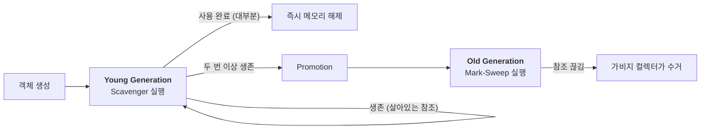

# Memory Management

## 1. Dart의 메모리 할당 전략: Pointer Bumping

Dart는 객체를 생성할 때 메모리를 할당하는 속도가 매우 빠릅니다. 그 비결은 **Pointer Bumping** 기술에 있습니다.

- **원리**: Dart는 메모리 힙(Heap)을 거대한 선형 공간으로 관리합니다. 새로운 객체가 생성되면 메모리 포인터를 객체의 크기만큼 옆으로 밀기만 하면 할당이 끝납니다.
- **이점**: 복잡한 빈 곳 찾기 과정이 없기 때문에 StatelessWidget과 같은 수천 개의 가벼운 객체를 생성하는 오버헤드가 거의 제로에 가깝습니다.

## 2. 세대별 가비지 컬렉션 (Generational GC)

Dart는 객체의 수명에 따라 메모리 구역을 두 곳으로 나누어 관리합니다. 대부분의 객체는 생성된 직후 곧바로 쓸모없어진다는 Weak Generational Hypothesis에 근거합니다.

### ① Young Generation

대부분의 Flutter 위젯이 여기서 처리됩니다.

- **대상**: 수명이 짧은 객체 (Ephemeral objects).
- **방식 (Copying GC)**: 구역을 두 개의 세미 스페이스(Semi-space)로 나눕니다. 한쪽이 꽉 차면 **살아있는 객체만** 다른 쪽으로 복사하고 나머지는 통째로 날려버립니다.
- **특징**: 살아있는 것만 골라내는 방식이라 **매우 빠릅니다(보통 수 밀리초 이내).** 화면 프레임(16.6ms)에 영향을 주지 않아 Jank를 방지합니다.

### ② Old Generation - "Mark-Sweep-Compact"

로그인 정보, 이미지 캐시 등 앱 실행 내내 살아남는 객체들이 머무는 곳입니다.

- **대상**: Young 구역에서 여러 번의 GC를 견디고 살아남은 객체.
- **방식**:
    1. **Mark**: 루트에서부터 참조를 추적해 살아있는 객체에 마킹합니다.
    2. **Sweep**: 마킹되지 않은(죽은) 객체를 메모리에서 제거합니다.
    3. **Compact**: 파편화된 메모리 공간을 하나로 모읍니다.
- **특징**: Young GC보다 훨씬 무겁고 시간이 오래 걸립니다.

## 3. 객체의 생애 주기 시각화 (Mermaid)



## 4. Flutter에서 자주 발생하는 메모리 누수 (Memory Leaks) ⭐

GC가 아무리 똑똑해도 개발자가 참조를 끊지 않으면 메모리는 해제되지 않습니다.

### 1) Stream을 닫지 않았을 때

```dart
class MyState extends State<MyWidget> {
  void initState() {
    super.initState();
    // 이 스트림은 화면이 나가도 계속 돌아가며 State 객체를 붙잡고 있음
    someGlobalStream.listen((data) { ... }); 
  }
}
```

- **해결**: dispose()에서 StreamSubscription.cancel()을 반드시 호출해야 합니다.

### 2) Timer가 계속 실행 중일 때

Timer.periodic은 별도의 로직으로 멈춰주지 않으면 앱이 꺼질 때까지 메모리를 점유합니다.

### 3) Global Variable / Static 필드

전역 변수에 리스트를 만들고 객체를 계속 추가만 하고 비우지 않으면, 그 객체들은 절대 Old Generation에서 해제되지 않습니다.

## 🔍 Tip

1. **위젯 내부 로직 최적화**: build() 메서드 안에서 너무 무거운 객체(예: 큰 리스트 가공)를 매번 생성하지 마세요. GC 부하가 커집니다.
2. **DevTools Memory 탭 활용**:
    - **Heap Snapshot**: 현재 메모리에 어떤 객체가 몇 개나 있는지 스냅샷을 찍어 비교할 수 있습니다.
    - **Allocation Tracing**: 어떤 함수가 메모리를 가장 많이 잡아먹는지 추적하세요.
3. **Image 캐시 관리**: 고해상도 이미지는 순식간에 Old Generation을 가득 채웁니다. cached_network_image 등의 라이브러리를 써서 최대 캐시 크기를 제한하는 설정이 중요합니다.

## 요약

### 🚀 핵심 전략: Generational GC

Dart는 객체의 수명에 따라 두 가지 GC 전략을 사용합니다.

1. **Young Generation (Scavenger)**: 짧은 수명의 위젯을 처리하며, 초고속 복사 알고리즘을 사용해 렌더링 성능을 방해하지 않습니다.
2. **Old Generation (Mark-Sweep)**: 장수 객체를 관리하며, 메모리 파편화를 방지하기 위해 압축(Compaction) 과정을 포함합니다.

### ⚡ 빠른 할당: Pointer Bumping

Dart VM은 메모리 포인터를 단순히 이동시키는 방식으로 객체를 할당하여, 현대적인 CPU 캐시 시스템에 최적화된 성능을 제공합니다.

### ⚠️ 메모리 누수 주의보

- **Stream/Timer**: `dispose()` 단계에서 반드시 해제 처리.
- **Closures**: 익명 함수가 외부 변수(특히 Context)를 캡처하여 의도치 않게 객체 수명을 연장하는 경우 주의.

### 🛠️ Profiling Tools

Flutter DevTools의 **Memory** 탭을 정기적으로 확인하여 Heap의 성장을 모니터링하는 습관이 고성능 앱 개발의 필수 요건입니다.